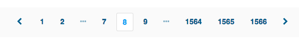
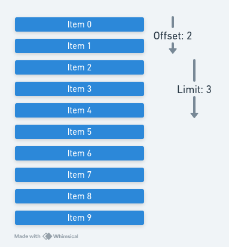
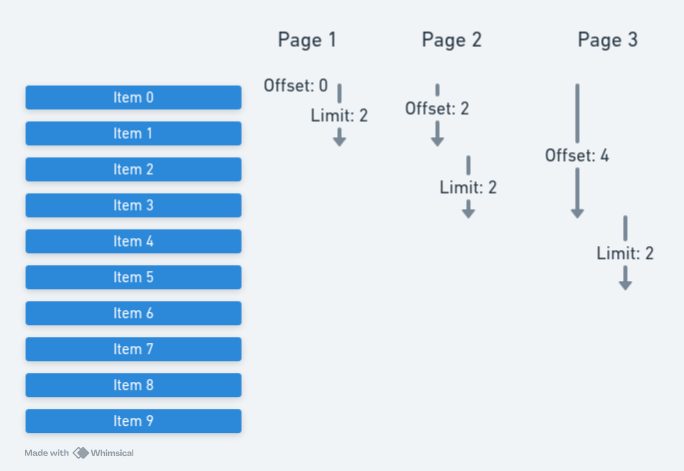

# Why you shouldn't use offset/limit (visibly) 🥷

Notes:

- Spoilers
  - Offset/limit pagination is actually pretty good
  - Keep using it, but use it knowing the risks and maybe pretend you are not
- Why pagination
  - At abusix we're dealing with tables with 1m+ rows
  - Data transfer, database performance, browser performance


## The Offset/Limit Api

### Request

https://pokeapi.co/api/v2/pokemon?offset=40&limit=20

### Code

```js
const results = [];
for (let pageNumber = 0; pageNumber < PAGES_TO_FETCH; pageNumber++) {
  const offset = pageNumber * PAGE_SIZE;
  const requestUrl = `${BASE_URL}pokemon?offset=${offset}&limit=${PAGE_SIZE}`;
  const response = await fetch(requestUrl);
  const resultWrapper = await response.json();
  results.push(...resultWrapper.results);
}
```

### UI


Notes:

- Don't actually use a for loop to iterate through pages (unless for a slow-running script etc)
  - Just to demonstrate how a frontend application would iterate through pages
- Features of offset/limit
  - Select the page size
  - Jump to any page you want


## Knex example implementation 🧑‍💻

```js
function getItems(offset, limit) {
    return knex('items')
      .select('*')
      .offset(offset)
      .limit(limit);
}
```


## How it works 🧬



- 2 scans
  - One to get to the start point
  - One to get the data

Notes:

- All these examples use relational databases


## Reasoning about performance 🏎️



- The start point scan gets longer each time
- The data scan is constant

Notes:

- Consider the trivial case where we are loading a page size of two and travelling through pages
- Points
- For each subsequent page we're scanning over rows the previous page did


## Demo: Some real database numbers 🕹️

Notes:

- Sql files (1) to (4)


## Demo: Takeaways 📋

- Postgres can scan really fast
- The performance of an offset/limit query scales linearly

Notes:

- We just scanned one million rows in less than a 10th of a second
- The more rows we have the scan, the slower the query
- First pages come back really fast, last pages come back really slow


## Cursors: When offset/limit isn't fast enough

### Request

https://api.notion.com/v1/users?page_size=10&start_cursor=fe2cc560-036c-44cd-90e8-294d5a74cebc

### Code

```js
let requestUrl = `https://api.notion.com/v1/users?page_size=10`;
let pageData;
do {
    console.log(`Fetching ${requestUrl}`);
    const pageResponse = await fetch(requestUrl, REQUEST_OPTIONS);
    pageData = await pageResponse.json();
    results.push(...pageData.results);
    requestUrl = `https://api.notion.com/v1/users?page_size=10&start_cursor=${pageData.next_cursor}`;
} while (pageData.next_cursor && results.length < RECORDS_TO_FETCH);
```

### UI


Notes:

- Get records **after** (or before) a cursor
- UI
  - Infinite scroll
  - Load more


## Limitations compared to offset/limit 📉

- Needs to be sorted (and consistently between pages)
- Need an index to get any improvement over offset/limit
- Can't jump to a specific page
- Introduces extra complexity


## Demo: frontend JS examples 🕹️

Notes:
- JS files (1) to (3)


## Knex example implementation 🧑‍💻

```js
async function getItems(cursor) {
    const { afterId } = decodeCursor(cursor);
    const results = knex('items')
      .select('*')
      .orderBy('name', 'desc')
      .where('id', '>', afterId)
      .limit(PAGE_SIZE + 1);
    
    if(results.length > PAGE_SIZE) {
      return {
        data: results.slice(0, PAGE_SIZE),
        meta: {
          nextCursor: encodeCursor({ 
            afterId: results[PAGE_SIZE].id
          }),
        }
      }
    } else {
      return {
        data: results,
        meta: { nextCursor: null }
      };
    }
}
```


## On sorting parameters 🔝

```js
async function getItems(cursor, sort) {
    const { afterId, previousSort } = decodeCursor(cursor);
    if(sort !== previousSort) {
        throw new BadArgumentException("The provided cursor is not compatible with the provided sort argument, please return to the first page with the new sort parameter.")
    }
    ...
}
```


## How it works 🧬

- One lookup to get the start point (hopefully indexed)
- One scan to get the data

Notes:

- Databases are great at looking up records (binary search trees)
- If we consider the previous scan `O(n)` then an index lookup should be `O(logn)`
- Note that this could be slower than our offset limit implementation for early pages
- Still need to scan to get the actual results (nothing changed there)


## Demo: More real postgres numbers 🕹️

Notes:

- Sql File (5)


## Demo: Takeaways 📋

- As expected no significant difference for small datasets or early pages
- Orders of magnitude faster for late pages of large datasets


## Story Time 📖

### The real problem with offset/limit

https://pokeapi.co/api/v2/pokemon?offset=40&limit=20


Notes:

- As we've seen most of the time there is absolutely nothing wrong with using offset/limit
- Consider this scenario (one I have been through before):
  - You develop a new product or feature that has a public api
  - Your data sets are small and traffic low and you want to move fast so you develop with offset/limit pagination
  - More and more customers adopt the product, data sets grow larger and the api sees more use
  - Performance starts struggling - particularly when some customers use your api allowing to jump to late pages
  - You start preparing a cursor implementation
  - It's a breaking change


## A compromise?

```js
async function getItems(cursor) {
    const { offset } = decodeCursor(cursor);

    const results = await knex('items')
      .select('*')
      .offset(offset)
      .limit(PAGE_SIZE + 1);

    if(results.length > PAGE_SIZE) {
      return {
        data: results.slice(0, PAGE_SIZE),
        meta: {
          nextCursor: encodeCursor({
            offset: offset + PAGE_SIZE
          }),
        },
      };
    } else {
      return {
        data: results,
        meta: { nextCursor: null }
      };
    }
}
```

Notes:
- deobfuscate
- query
- obfuscate
- The parts other than the query should be relatively easy to generalize and extract into functions


## `encodeCursor`?

```js
function encodeCursor(cursor) {
  const cursorAsString = JSON.stringify(cursor);
  return Buffer.from(cursorAsString).toString('base64');
}

function decodeCursor(encodedCursor) {
    const cursorAsString = Buffer.from(encodedCursor, 'base64').toString()

  // Definitely run through validation before trusting blindly
  return JSON.parse(cursorAsString);
}
```

Notes:

- As you can see this serves no real functional purpose
- It's intended to signal to the frontend or consumer that the actual contents of cursor is subject to change and should not be manually constructed or deconstructed


## A final demo 🕹️

Notes:
- JS file (4)
- Also show example code from our repo if time


## So what? 🤷

- Before reaching for offset/limit consider how large your data sets will be.
- When using offset/limit strongly consider obfuscating that fact so that you have the chance to migrate.


# Thanks for your attention 🫡

## Resources

- All the example code: https://github.com/invariablyabandoned/offset-limit
- GraphQL pagination docs: https://graphql.org/learn/pagination/
- JSON API cursor pagination docs: https://jsonapi.org/profiles/ethanresnick/cursor-pagination/
